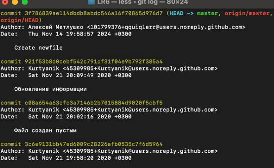
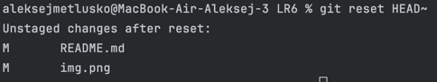
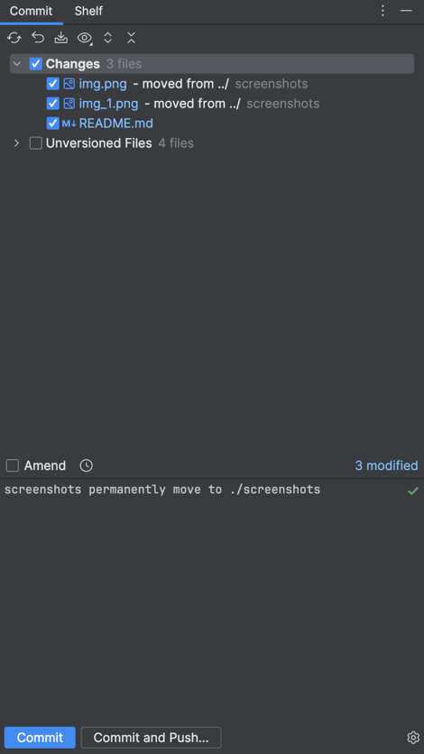
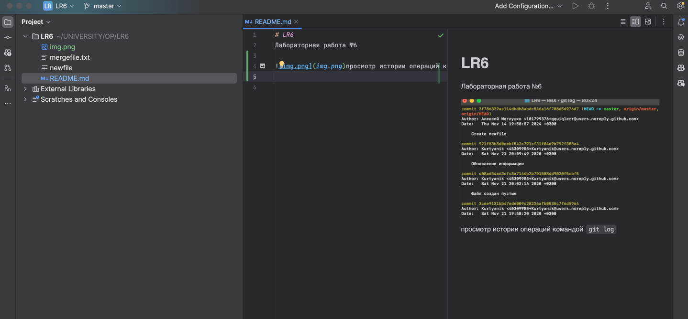
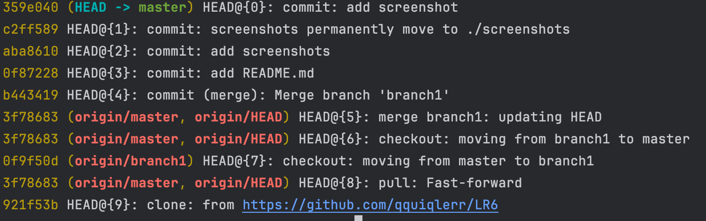

# LR6
Лабораторная работа №6

# Последовательность действий
1. Клонировал GitHub репозиторий используя
```bash
git clone https://github.com/qquiqlerr/LR6
```


2. Просмотрел логи всех веток
```bash
git branch
git log branch1
git log master
```
просмотр истории операций командой `git log`




3. Смержил ветку branch1 в master используя средства IDE для разрешения конфликтов


4. Удалил branch1 с помощью
```bash
git branch -d branch1
```


5. Сделал несколько коммитов, оставляя логичные и понятные комментарии

окно работы с git в JetBrains IDE



6. Удалил последний коммит с помощью
```bash
git reset HEAD~
```

7. Создал новую ветку для отчета


8. Удалил отчет с мастера и залил в отдельную ветку


9. Понял что намудрил и слил мастер в otchet чтобы перетянуть скрины


работа с README.md в JetBrains IDE



reflog

 


## git log

```text
git log --pretty=format:'%h %cd %an %s' --date=short
5b70937 2024-11-14 4319 Метлушко А. Ю Merge branch 'master' into otchet
5bce2c5 2024-11-14 4319 Метлушко А. Ю commit README.md
80e7ce6 2024-11-14 4319 Метлушко А. Ю init README.md
cdfd2d1 2024-11-14 4319 Метлушко А. Ю screenshots
5586e7e 2024-11-14 4319 Метлушко А. Ю move readme to new branch
c2ff589 2024-11-14 4319 Метлушко А. Ю screenshots permanently move to ./screenshots
aba8610 2024-11-14 4319 Метлушко А. Ю add screenshots
0f87228 2024-11-14 4319 Метлушко А. Ю add README.md
b443419 2024-11-14 4319 Метлушко А. Ю Merge branch 'branch1'
3f78683 2024-11-14 Алексей Метлушко Create newfile
921f53b 2020-11-21 Kurtyanik Обновление информации
0f9f50d 2020-11-21 Kurtyanik Заполнил файл
c08a654 2020-11-21 Kurtyanik Файл создан пустым
```
